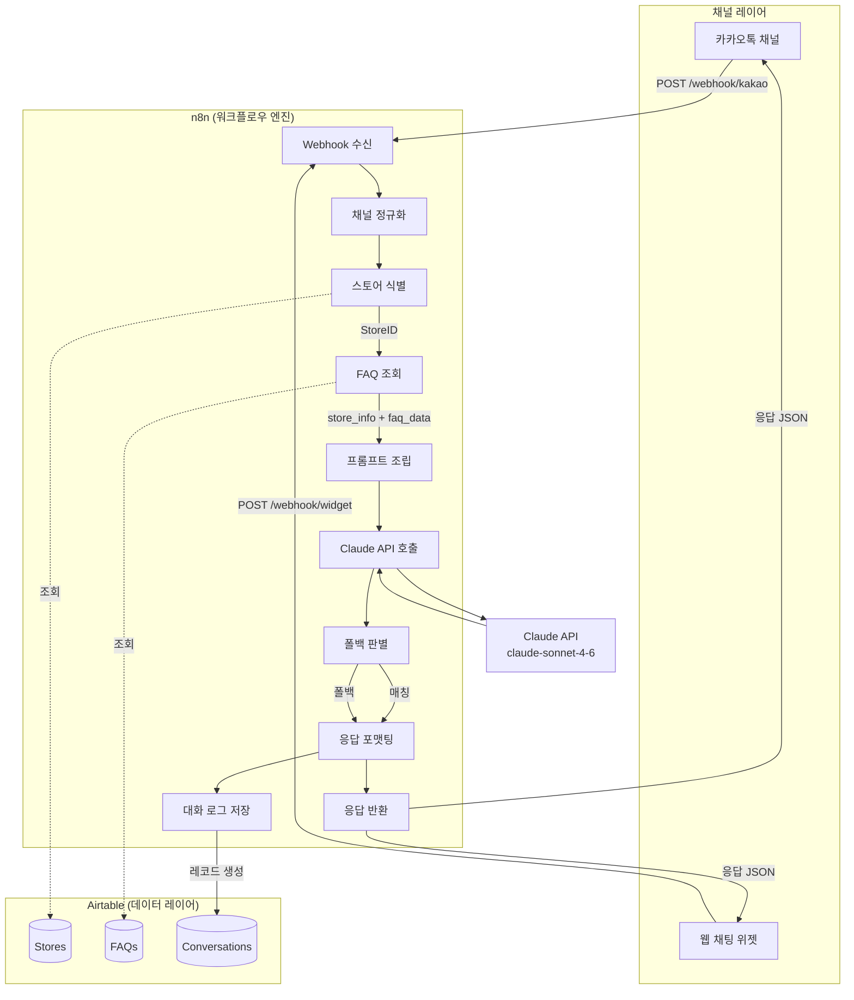
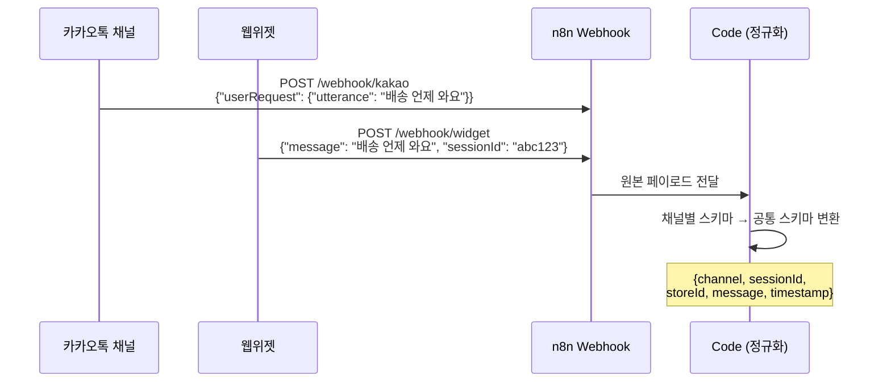
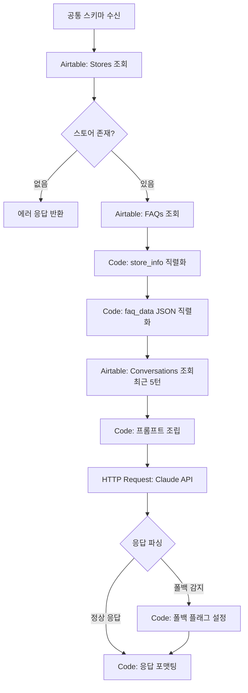
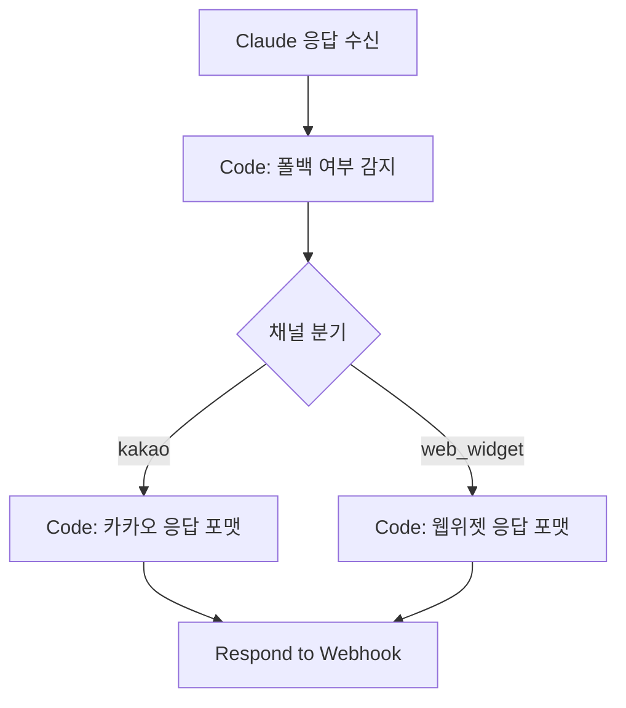
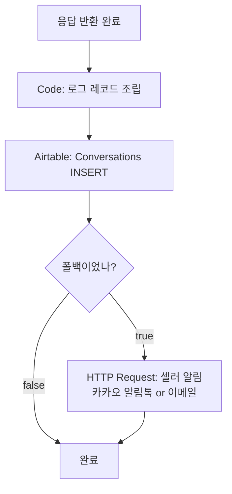

# 시스템 아키텍처
> design/architecture.md
> 작성일: 2026-03-18

---

## 전체 구성도



---

## 플로우 1: 메시지 수신



### n8n 노드 구성

| 순서 | 노드 타입 | 노드명 | 역할 |
|------|-----------|--------|------|
| 1 | **Webhook** | `Receive Message` | 카카오/웹위젯 POST 수신. Path: `/webhook/kakao`, `/webhook/widget` |
| 2 | **Switch** | `Channel Router` | `channel` 값으로 분기 (kakao / web_widget) |
| 3 | **Code** | `Normalize Payload` | 채널별 페이로드 → 공통 스키마 변환 |

**공통 스키마 (정규화 결과):**
```json
{
  "channel": "kakao",
  "sessionId": "kakao_Uxxx_20260318",
  "storeId": "1",
  "message": "배송 언제 와요",
  "timestamp": "2026-03-18T14:23:00Z"
}
```

---

## 플로우 2: 처리 (스토어 식별 → Claude 응답)



### n8n 노드 구성

| 순서 | 노드 타입 | 노드명 | 역할 |
|------|-----------|--------|------|
| 4 | **Airtable** | `Get Store Config` | `StoreID`로 Stores 테이블 레코드 조회 |
| 5 | **IF** | `Store Exists?` | 스토어 미존재 시 에러 분기 |
| 6 | **Airtable** | `Get FAQs` | `StoreID` 필터 + `IsActive=true` 필터로 FAQs 조회 |
| 7 | **Airtable** | `Get Recent Conversations` | `SessionID` 기준 최근 5건 조회 |
| 8 | **Code** | `Build Prompt` | store_info 직렬화 + faq_data JSON화 + 대화 이력 포맷 + 프롬프트 조립 |
| 9 | **HTTP Request** | `Call Claude API` | `POST https://api.anthropic.com/v1/messages` |

**Claude API 요청 형식:**
```json
{
  "model": "claude-sonnet-4-6",
  "max_tokens": 300,
  "system": "<system_prompt with store_info + faq_data>",
  "messages": [
    {"role": "user", "content": "<conversation_history>\n\n고객 문의: <customer_message>"}
  ]
}
```

**`Build Prompt` 코드 노드 핵심 로직:**
```javascript
const store = $node["Get Store Config"].json;
const storeInfo = `스토어명: ${store.StoreName}
배송사: ${store.ShippingCarrier}
출고 소요일: ${store.ShipOutDays}영업일
배송 소요일: ${store.ShippingDays}영업일
당일 출고 마감: ${store.CutoffTime}
교환 가능 기간: 수령 후 ${store.ExchangePeriod}일
반품 가능 기간: 수령 후 ${store.ReturnPeriod}일
단순 변심 반품 배송비: ${store.ReturnShippingCost}원
환불 처리 소요일: ${store.RefundDays}영업일
영업시간: ${store.BusinessHours} (${store.BusinessDays})
휴무: ${store.HolidayInfo}`;

const faqs = $items("Get FAQs");
const faqData = JSON.stringify(faqs.map(f => ({
  category: f.json.Category,
  question_patterns: JSON.parse(f.json.QuestionPatterns),
  answer_template: f.json.AnswerTemplate,
  variables: JSON.parse(f.json.Variables)
})), null, 2);

const history = $items("Get Recent Conversations");
const conversationHistory = history
  .map(c => `[Customer]: ${c.json.CustomerMessage}\n[Bot]: ${c.json.BotResponse}`)
  .join('\n');

return [{ json: { storeInfo, faqData, conversationHistory } }];
```

---

## 플로우 3: 응답 반환



### n8n 노드 구성

| 순서 | 노드 타입 | 노드명 | 역할 |
|------|-----------|--------|------|
| 10 | **Code** | `Detect Fallback` | 응답 텍스트에 "담당자에게 전달" 포함 여부로 폴백 감지, `wasFallback` 플래그 설정 |
| 11 | **Switch** | `Channel Response Router` | channel 값으로 응답 포맷 분기 |
| 12 | **Code** | `Format Kakao Response` | 카카오 i오픈빌더 응답 JSON 스키마로 포맷팅 |
| 13 | **Code** | `Format Widget Response` | 웹위젯 응답 JSON 스키마로 포맷팅 |
| 14 | **Respond to Webhook** | `Send Response` | 최종 응답 반환 (HTTP 200) |

**카카오 응답 포맷 (카카오 i오픈빌더 스키마):**
```json
{
  "version": "2.0",
  "template": {
    "outputs": [
      {
        "simpleText": {
          "text": "배송 안내드릴게요! 🚚\n\n결제 완료 후 1영업일 이내 출고됩니다."
        }
      }
    ]
  }
}
```

**웹위젯 응답 포맷:**
```json
{
  "sessionId": "widget_abc123",
  "message": "배송 안내드릴게요! 🚚\n\n결제 완료 후 1영업일 이내 출고됩니다.",
  "timestamp": "2026-03-18T14:23:02Z"
}
```

---

## 플로우 4: 로깅



### n8n 노드 구성

| 순서 | 노드 타입 | 노드명 | 역할 |
|------|-----------|--------|------|
| 15 | **Code** | `Build Log Record` | Conversations 테이블 레코드 조립 |
| 16 | **Airtable** | `Save Conversation` | Conversations 테이블에 INSERT |
| 17 | **IF** | `Was Fallback?` | WasFallback=true 분기 |
| 18 | **HTTP Request** | `Notify Seller` | 폴백 발생 시 셀러에게 카카오 알림톡 또는 이메일 발송 |

**로그 레코드 조립:**
```javascript
return [{
  json: {
    StoreID: [$input.item.json.storeRecordId],
    SessionID: $input.item.json.sessionId,
    Channel: $input.item.json.channel,
    CustomerMessage: $input.item.json.message,
    BotResponse: $input.item.json.botResponse,
    MatchedFAQID: $input.item.json.matchedFaqId
      ? [$input.item.json.matchedFaqId] : [],
    MatchedCategory: $input.item.json.matchedCategory || '',
    WasFallback: $input.item.json.wasFallback,
    ResponseTimeMs: $input.item.json.responseTimeMs
  }
}];
```

---

## 전체 n8n 워크플로우 노드 요약

| # | 노드 타입 | 노드명 | 플로우 |
|---|-----------|--------|--------|
| 1 | Webhook | `Receive Message` | 수신 |
| 2 | Switch | `Channel Router` | 수신 |
| 3 | Code | `Normalize Payload` | 수신 |
| 4 | Airtable | `Get Store Config` | 처리 |
| 5 | IF | `Store Exists?` | 처리 |
| 6 | Airtable | `Get FAQs` | 처리 |
| 7 | Airtable | `Get Recent Conversations` | 처리 |
| 8 | Code | `Build Prompt` | 처리 |
| 9 | HTTP Request | `Call Claude API` | 처리 |
| 10 | Code | `Detect Fallback` | 응답 |
| 11 | Switch | `Channel Response Router` | 응답 |
| 12 | Code | `Format Kakao Response` | 응답 |
| 13 | Code | `Format Widget Response` | 응답 |
| 14 | Respond to Webhook | `Send Response` | 응답 |
| 15 | Code | `Build Log Record` | 로깅 |
| 16 | Airtable | `Save Conversation` | 로깅 |
| 17 | IF | `Was Fallback?` | 로깅 |
| 18 | HTTP Request | `Notify Seller` | 로깅 |

---

## 비기능 설계

### 에러 처리

| 상황 | 처리 방식 |
|------|-----------|
| Claude API 타임아웃 (>5s) | 폴백 응답 반환 + 셀러 알림 |
| Airtable API 실패 | n8n Error Workflow 트리거 |
| 스토어 미존재 | `"서비스 설정 중입니다. 잠시 후 다시 문의해 주세요."` 반환 |
| 카카오 웹훅 인증 실패 | HTTP 401 반환 |

### 응답 시간 목표 (5초 이내)

| 구간 | 예상 소요 |
|------|-----------|
| Airtable 조회 3회 | ~600ms |
| 프롬프트 조립 (Code) | ~50ms |
| Claude API 호출 | ~1,500~3,000ms |
| 응답 포맷팅 + 반환 | ~100ms |
| **합계** | **~2,250~3,750ms** ✅ |
